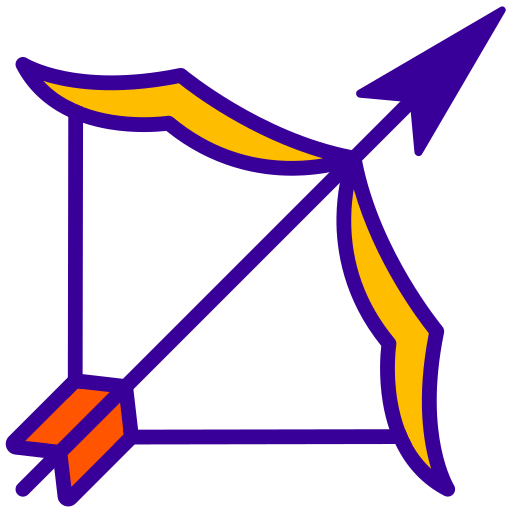

<h1>
    
     Kemilyn Carato
</h1>

Sou uma desenvolvedora front-end de Araraquara,Sp Brasil. Sempre fui uma pessoa apaixonada por tecnologia e jogos e no final do ano de 2022 comecei a estudar mais profundamente sobre front-end. Hoje em dia faço faculdade de Ánalise e desenvolvimento de sistemas na <a href="https://descomplica.com.br/faculdade/?utm_source=google&utm_medium=cpc&utm_campaign=psq-institucional-uee-ongoing-sitelink&gad_source=1&gclid=Cj0KCQiAxOauBhCaARIsAEbUSQT3PBfdzDhO5--Ajt5dnlv5sXxhCGz-7T2BKDDz3KaT3uEnFZt5wGIaAiZ-EALw_wcB">Descomplica faculdade digital</a>, e aguardo pela minha primeira oportunidade no mundo da técnologia.💻 

Gosto de animes , jogos ,livros, música e também muita dança. Sigo evoluindo e aprendendo cada dia mais.👾

<h3 >Conecte-se comigo !</h3>

<h3 >Habilidades:</h3>

<a href="https://github.com/seu-usuário-aqui">

<h3 >Habilidades!</h3>

  

 
 
  - Icon flecha <a href="https://br.freepik.com/icone/tiro-arco_6796448#fromView=search&page=12&position=49&uuid=f3b00dda-ef76-4ec7-abba-afee06efb271">Ícone de Alejandro</a></a> 
  - modelo <a href="https://github.com/elidianaandrade/elidianaandrade/blob/main/README.md?plain=1">elidianandrade</a>
 
  
Feito com carinho 💜 por <a href="https://github.com/elidianaandrade">Kemilyn.</a>

